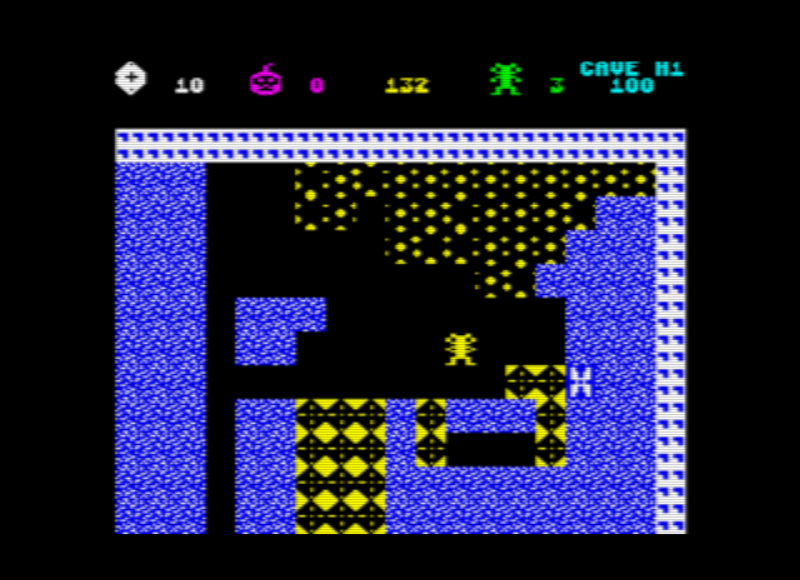
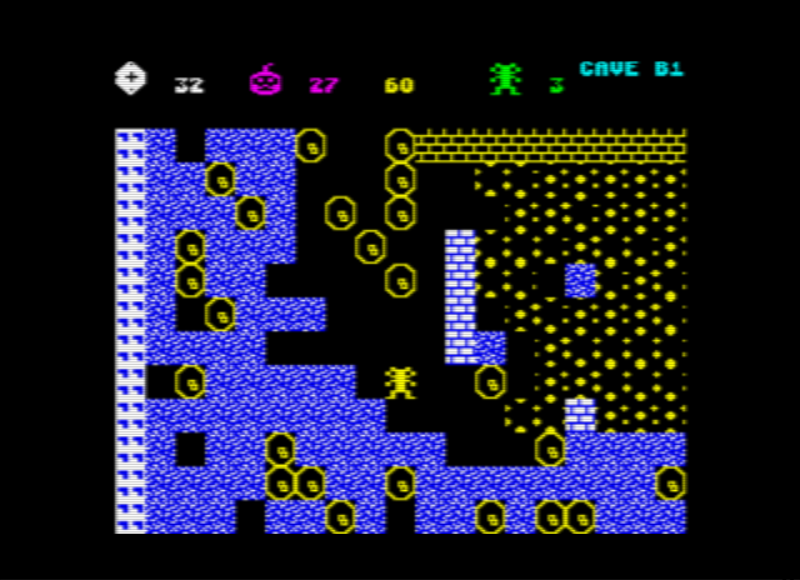

# Boulder Dash for the Oric
This is a fan-developed version of Boulder Dash for the Oric (Oric-1 or Atmos).
I thought it would be a good way of getting to find out more about the Oric-1 I recently purchased by porting the BBC/Acorn Electron version of Boulder Dash to this platform.

This repo really contains 6 different versions of the game. They all run with the same 'game engine' but have different caves. Select the version to play from the splash screen.

- Boulder Dash, Boulder Dash 2 and Boulder Dash 3, are similar to the original games released for other platforms in the 1980's.

- Boulder Dash +1 contains two main enhancements not in the other versions, the use of bombs and having zero-gravity caves.

- The Arno Dash games are some examples of the many fan-developed caves found on [Arno's Boulder Dash fansite](https://www.boulder-dash.nl/). Boulder Dash format files (BDCFF) are used to create new caves which run with the game-engine.

## Oric-1, Atmos and emulation
[Oric Boulder Dash](./tap/BOULDERDASH.tap) is available in the tap folder.

The quickest way to give it a try is via the [JOric emulator](https://oric.games/?url=https://raw.github.com/raspberrypioneer/OricBoulderDash/master/tap/BOULDERDASH.tap). More about this emulator is available [here](https://github.com/lanceewing/joric).

It has been tested using the [Oricutron emulator](https://osdk.org/index.php?page=documentation&subpage=oricutron) and on a real Oric-1. The game TAP file was loaded via the excellent [LOCI device](https://github.com/sodiumlb/loci-hardware/wiki/LOCI-User-Manual). This device also allows the Oric-1 to use the Atmos ROM v1.1 so although the game works with both the Oric-1 and Atmos, the default build is for the Atmos. See the simple steps below to switch to an Oric-1 build.

There are some differences in this Oric version of the game, although they do not affect the main game play.
- Bombs and zero-gravity enhancements. These are only used in caves where they have been defined as cave parameters (see below for more details).
- The status bar is different as it shows the diamonds needed, reduced each time one is gathered. The diamond value is not shown. A count of the number of bombs available is included, as are the normal things such as time remaining, lives available and the player score.
- Currently there is no intro tune although this may be added in future. Other future improvements being considered are the ability to choose the keys to use for up-down-left-right and fire. Joystick support might be an option via the LOCI device. Lower down the list are possibly having a demo mode, overall high score and support for 2 players.

## Keys used
- The version to play is selectable from the splash screen using the up-down arrow keys and pressing the space bar.
- Both the cave and difficulty level are selectable from the main screen using the up-down, left-right arrow keys. Pressing the space bar starts the game.
- Different colour schemes are selectable using the "<" and ">" keys.
- There is a choice of using the standard up-down, left-right arrow keys for navigation within the game or an alternate layout where the arrow keys on the left of the space bar are up-down and the arrow keys on the right are down-up (this feels more natural to me on a real Oric!). Pressing the left-shift key on the menu screen toggles between having standard or alternate keys.

- In the game, the direction keys are used to navigate Rockford around the cave. Holding down the space bar and pressing a direction key lets Rockford push a rock, clear a space, plant a bomb or grab a diamond, all without moving.
- The greater-than key `>` will pause the game. Pressing left-shift will kill Rockford (needed if trapped).

- The game comes with instructions which explain the main characters and features.

## Developer notes
- The `osdk_config.bat` script lists the assembler files used to build the game.
- The `bd_build_all.bat` script uses this config information and compiles `main.s` using the OSDK `make.bat` command which in turn uses the `xa.exe` assembly-language complier, linker and `header.exe` to make the game a loadable TAP file.
- The sprites are created as a separate TAP file, by assembling `spr.s`, adding a TAP header and naming the TAP file using `taptap.exe`.
- A splash screen TAP file is created using `pictconv.exe`, given a TAP header and name.
- The caves for each game version are combined then created as separate TAP files. Individual caves are found in `caves_bin`. These are already binary files and are combined into a single file, assigned a TAP header and name.
- The game, sprites and caves for all versions are all combined into a single TAP file to load on the Oric. The order of these files is important as the program does not rewind the tape to find the TAP file to load!

## Caves
- All 20 caves are available in memory (16 standard and 4 bonus caves). They each have the same size, 48 bytes used for parameters, 400 bytes for the map. Each tile in the map is a nibble (each byte represents two tiles). When a particular cave is about to be played, it is loaded into a section of memory labelled `cave_parameter_data`. See `cavedata.s` for more details about the parameters available. 
- New cave files can be converted from BDCFF files found on [Arno's Boulder Dash fansite](https://www.boulder-dash.nl/) using a conversion utility `BDCavegen.py` found in the `utilities` folder.

## Switching between Atmos and Oric-1
By default this game runs on the Oric Atmos but is easy to build for an Oric-1 instead. In `main.s` and `single_row_keyboard.s` (or `full_matrix_keyboard.s`), comment out the line `#define rom_v1_1`, then rebuild by running `bd_build_all.bat`.

If running on the Oricutron emulator, amend `oricutron.cfg` by commenting/uncommenting the lines `;machine = atmos` and `machine = oric1`.

## Switching between single row and full matrix keyboard
Although a single row keyboard is used (just having the arrow keys, space bar and a few other keys), a full matrix keyboard can be used instead. With some further development a choice of keys could be provided to users. The steps needed to switch are as follows.
- Amend `osdk_config.bat`, comment / uncomment keyboard requirement.
- Amend `main.s`, comment / uncomment `#define full_matrix_keyboard`.
- Amend `bd_build_all.bat`, comment / uncomment `CAVEADDR` requirement (the full matrix keyboard is a larger program, and changes the address where the caves are loaded).
- Run `bd_build_all.bat` to compile and create `caves.tap` with correct load address.

## Acknowledgements
The following sources have all helped to make this development possible and is gratefully acknowledged.
- The [OSDK](https://osdk.org/index.php) is a fantastic source for all things Oric development-related. The articles and samples were especially helpful.
- The [keyboard read routine](https://github.com/Oric-Software-Development-Kit/Oric-Software/tree/master/routines/single_row_keyboard_read) available via the OSDK makes it easy to add effective keyboard handling into a game.
- The [Defence Force forum](https://forum.defence-force.org/index.php) is a great source of information. The [sound fx generator](https://forum.defence-force.org/viewtopic.php?t=2280) was used to create the sound effects. The [Oric Boulder Dash chat](https://forum.defence-force.org/viewtopic.php?t=2714) has guided further development with helpful input from Oric experts.
- The book [Oric Atmos and Oric 1 Graphics and Machine code techniques](https://library.defence-force.org/index.php?content=any&type=book&author=GeoffPhillips&page=books) available for download from the Oric library is a wealth of handy information.
- The [disassembly of the original BBC/Acorn Electron game](https://github.com/TobyLobster/Boulderdash) by TobyLobster was where this all started.
- [Arno's Boulder Dash fansite](https://www.boulder-dash.nl/)
